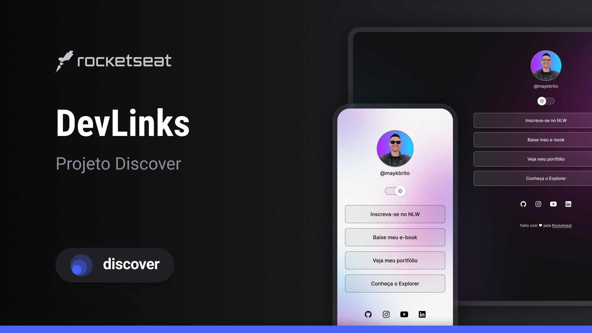

<h1 align="center"> DevLinks </h1>

Programa exclusivo e gratuito, promovido pela Rocketseat para ensino de tecnologias WEB.

  <a href="#-tecnologias">Tecnologias</a>&nbsp;&nbsp;&nbsp;|&nbsp;&nbsp;&nbsp;
  <a href="#-projeto">Projeto</a>&nbsp;&nbsp;&nbsp;|&nbsp;&nbsp;&nbsp;
  <a href="#-layout">Layout</a>&nbsp;&nbsp;&nbsp;|&nbsp;&nbsp;&nbsp;
  <a href="#memo-licença">Licença</a>

  

 

<<<<<<< HEAD
  
=======
  
>>>>>>> 6a57a3575bf0d29374c438699de19e7ee0ecbf4e

## 🚀 Tecnologias

Esse projeto foi desenvolvido com as seguintes tecnologias:

- HTML e CSS
- JavaScript
- Git e Github
<<<<<<< HEAD

## 💻 Projeto

O Calendário da Copa é um projeto que mostra os jogos da Copa de 2022.

## 🔖 Layout

Você pode visualizar o layout do projeto através [DESSE LINK](https://www.figma.com/file/J1Z33MISC22YZB8wfxiIns/NLW-Copa-Explorer/duplicate). É necessário ter conta no [Figma](https://figma.com) para acessá-lo.
=======
- Figma

## 💻 Projeto

O DevLinks é um agregador de links para usar como cartão de visitas online.

## 🔖 Layout

Você pode visualizar o layout do projeto através [DESSE LINK](https://www.figma.com/design/ZKy7D6MxSjgXeeRaLF05LV/DevLinks-%E2%80%A2-Projeto-Discover--Community-?node-id=10-620&p=f&t=v4yKR6bJosy8gKz8-0). É necessário ter conta no [Figma](https://figma.com) para acessá-lo.
>>>>>>> 6a57a3575bf0d29374c438699de19e7ee0ecbf4e

## :memo: Licença

Esse projeto está sob a licença MIT.

---

<<<<<<< HEAD
Feito com ♥ by Rocketseat :wave: [Participe da nossa comunidade!](https://discord.gg/rocketseat)
=======
<<<<<<< HEAD
Feito com ♥ by Rocketseat :wave: [Participe da nossa comunidade!](https://discord.gg/rocketseat)
=======
Feito com ♥ by Rocketseat :wave: [Participe da nossa comunidade!](https://discord.gg/rocketseat)
>>>>>>> b5b93df16a6ce88d21ccbb9b2d7cec57c4ef3a94
>>>>>>> 6a57a3575bf0d29374c438699de19e7ee0ecbf4e
